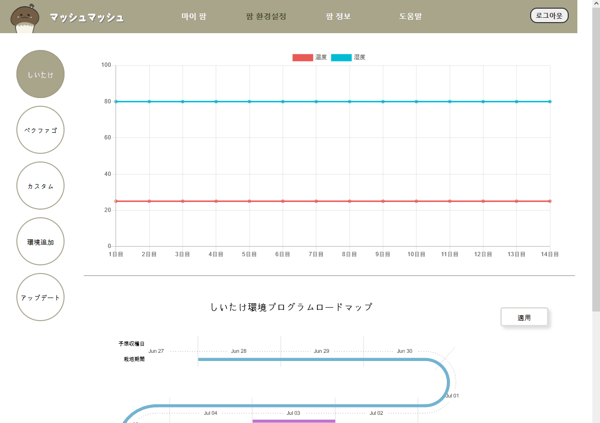
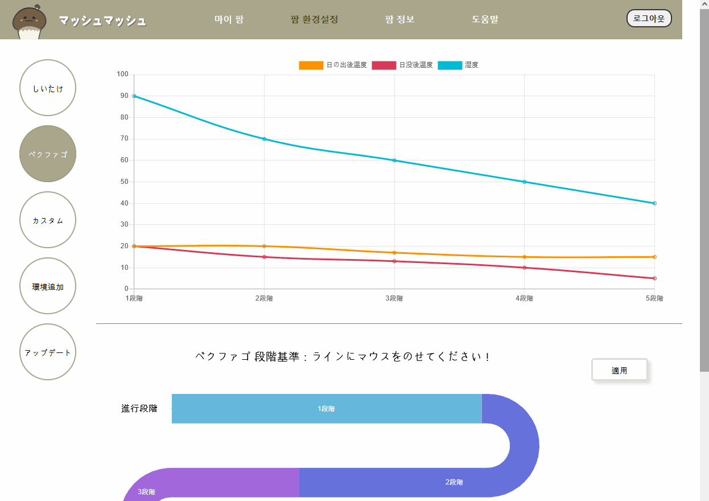
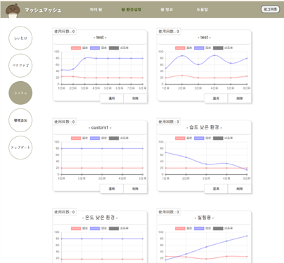
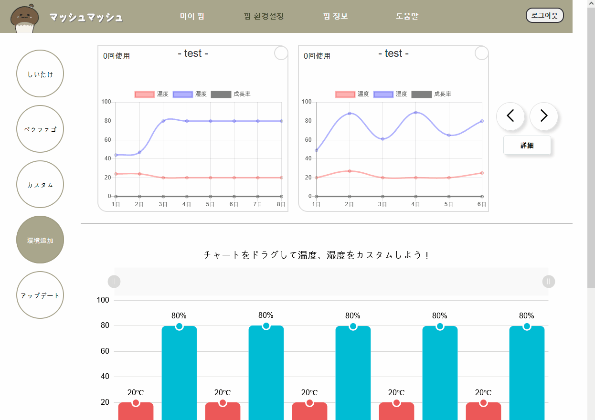

# マッシュマッシュ（Front-end）

## 担当パート
- ウェブに出るすべてのチャートの実装
- 環境設定ページ
-----

## 使用技術

    const javaScript = {
	    library: [
		    "React",
		    "chart.js",
		    "amcharts4"
	    ],
	    grammar: "ES6"
    };
  
 --- 

##　参考
Chart.js：[chartjs][chartjs]
amcharts：[amcharts][amcharts]

[amcharts]: https://www.amcharts.com/docs/v4/ "amcharts"
[chartjs]: https://www.chartjs.org/docs/latest/ "chartjs"

##  実装画面
- しいたけ環境適用ページ

- ベクファゴ環境適用ページ

- カスタム環境リスト

- 環境追加ページ
